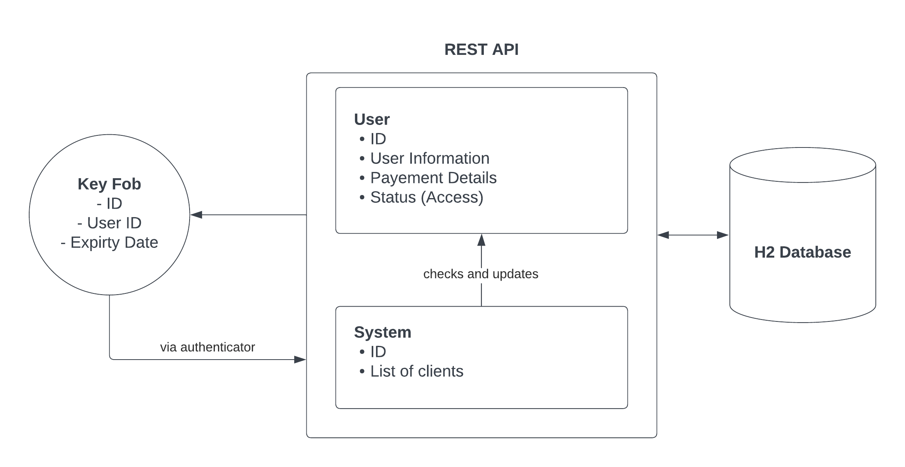

# Fob Access Management System

## Selection and Justification
Many establishments in the modern day rely on using key fobs for multiple purposes such as allowing entry to their premises or unlocking features or products. These key fobs utlilize RFID technology to read and communicate with the fob. In this project, we will be using REST API with Spring Boot to create a more functional, convenient fob access management system with additional features outlined below.This project will focus on creating a fob management system to be used in gyms and sports center with a subscription based payment model. By using this system, the gym can enhance security, streamline operations, and improve member experience.

## Project Outline
### Goals
By using this system, fitness establishments can enhance security, streamline operations, and improve member experience. The following goals must be achieved:
1. **Enhanced Security**: The fob must communicate with the API to verify if the user is allowed access to the facility or its features. Each fob will be unique to prevent unauthorized use.
2. **Convenience and Efficiency**: The fob does not require any staff intervention and allows for 24/7 access if needed.
3. **Membership Control**: The system communicates with fob and is able to allow easy activation, renewal, suspension, or termination of memberships. For example, if a customer’s payment method fails, the system can restrict access to the key fob.

### Functionalities
The following key functionalities will be implemented:
- **Fob**: when user taps the fob on the authenticator, real time communication utlizing REST API will determine access. The system uses the fob id and user id to determine who it is assigned to, and wether the user gets access to the facility.
- **System**: the system checks if the user will be granted access to it and also process the payments of the users. Users are required to pay for their subscription every 2nd of the month. When the payment details are on file, the system automatically charges the user and updates the user status (used to determine access granted or not). The system will also respond back to the authenticator to allow or deny access.

### Expected Outcomes
Once implemented, the Fob Access Management System plans to boost security and efficiency in gyms. It aims to achieve this by making sure only authorized people get in, managing memberships automatically, and giving users easy, 24/7 access. It'll also track activities for better decisions and save money by handling payments smoothly. Overall, it's set to make gym access safer, smoother, and more convenient for everyone involved.

## Architectural Diagram

The Key Fob when tapped on an authenticator, sends a request to the API for access attempt. The System controller captures the request and retrieves the user ID assigned to the key fob using the body of the request. The system will then check if the user has access to the facility. If true, the system will return a status OK code which will unlock the facility for the user. On the other end, the System has the capabilities to automatically charge the user’s payment method every 2nd of the month for their subscription. It can also update the details of the user and revoke access by changing the status variable. All data is stored in the database.

